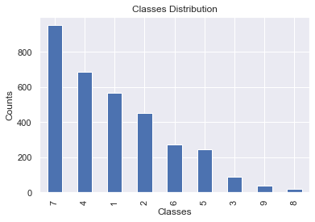
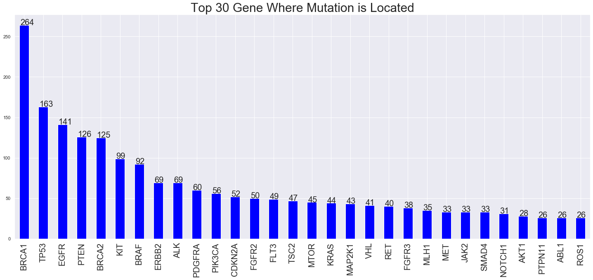
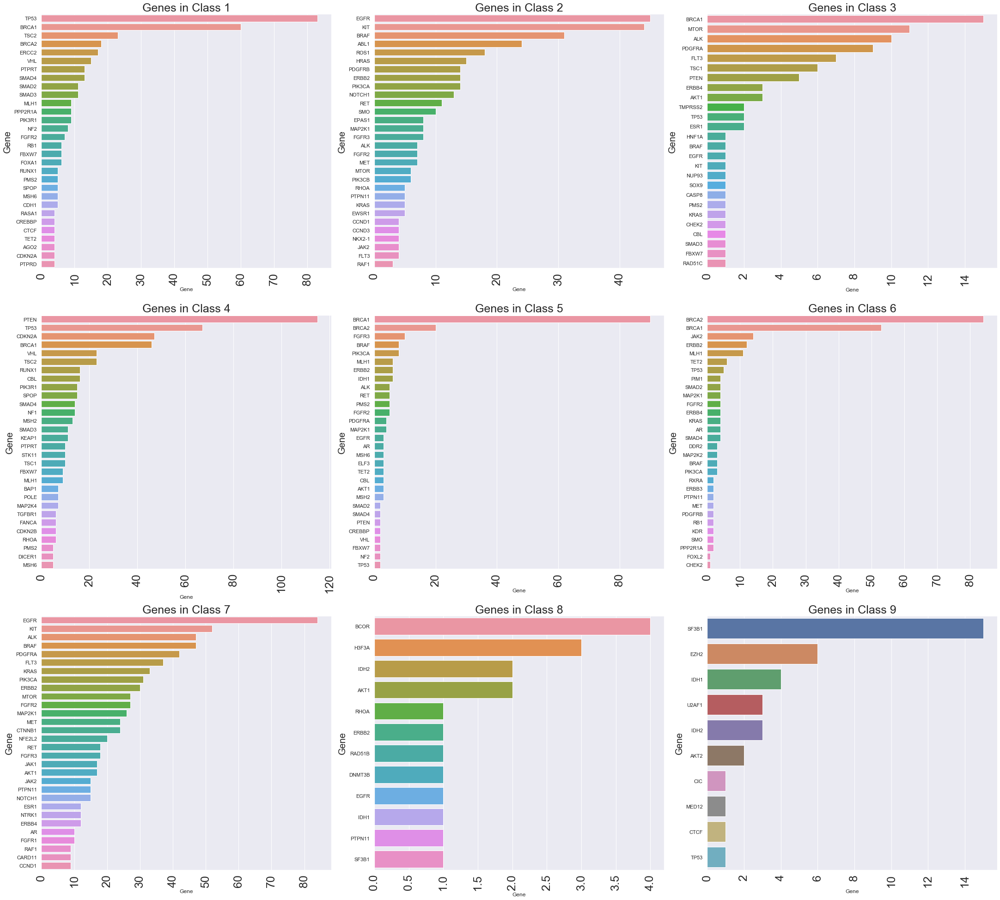
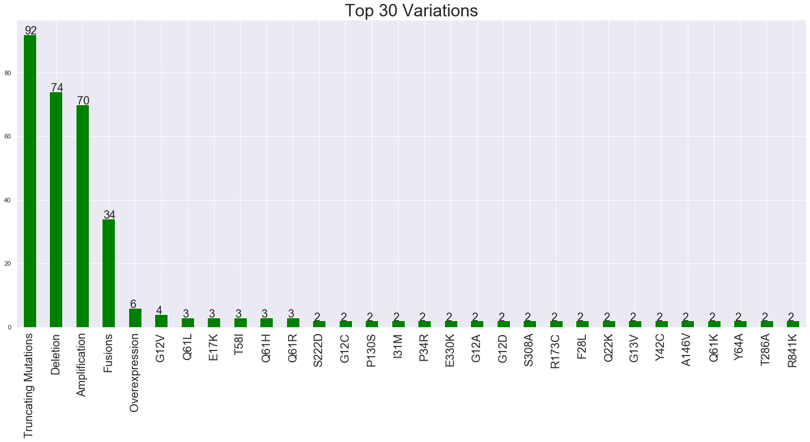
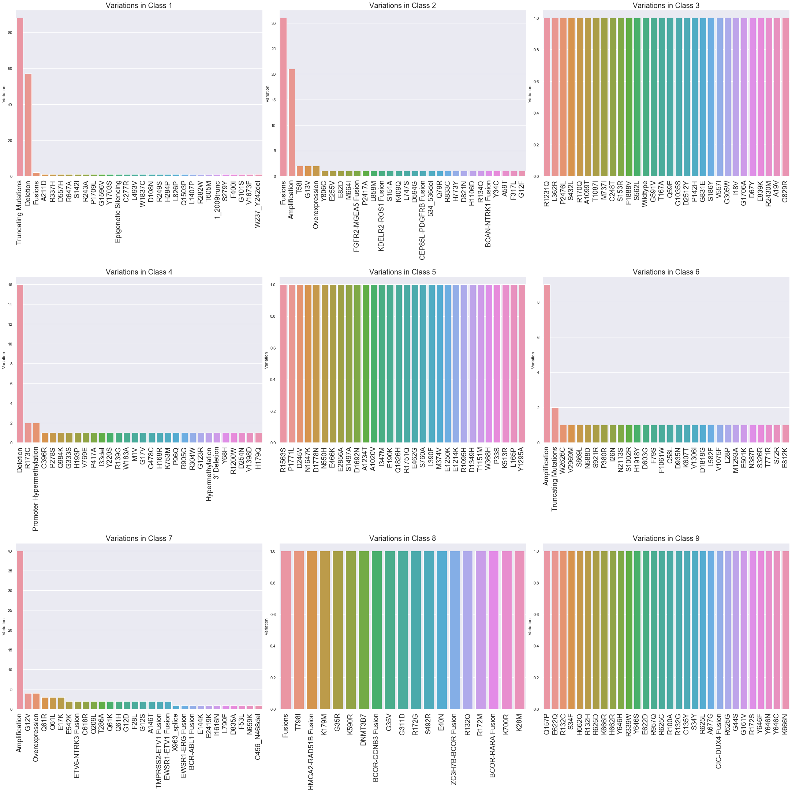
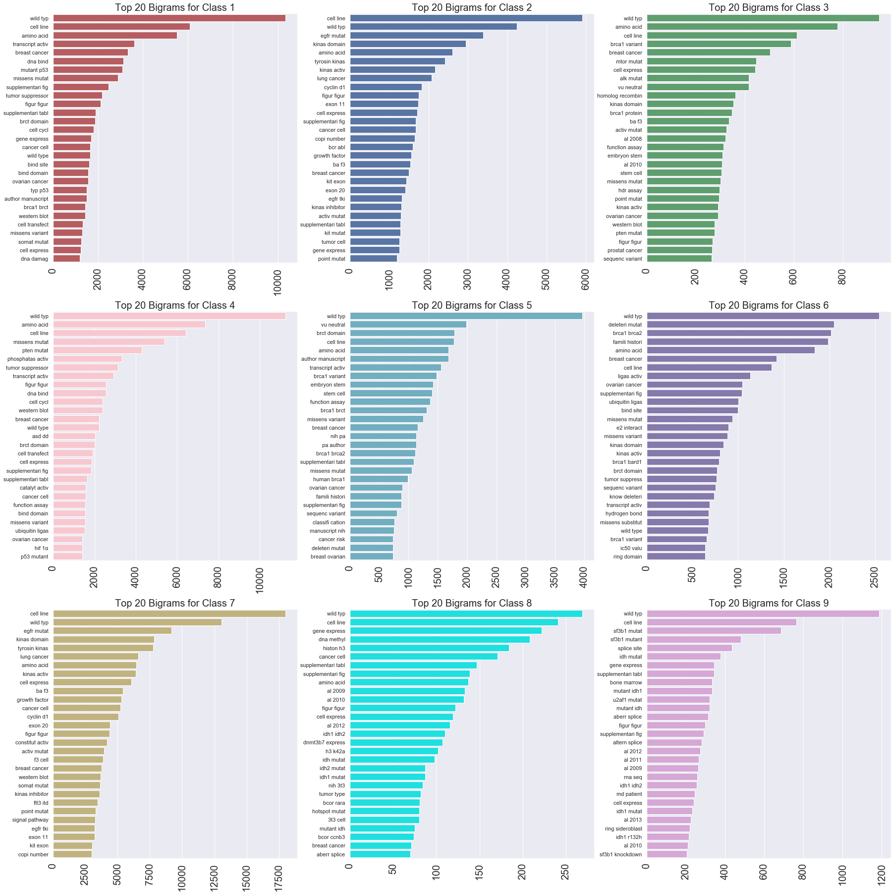
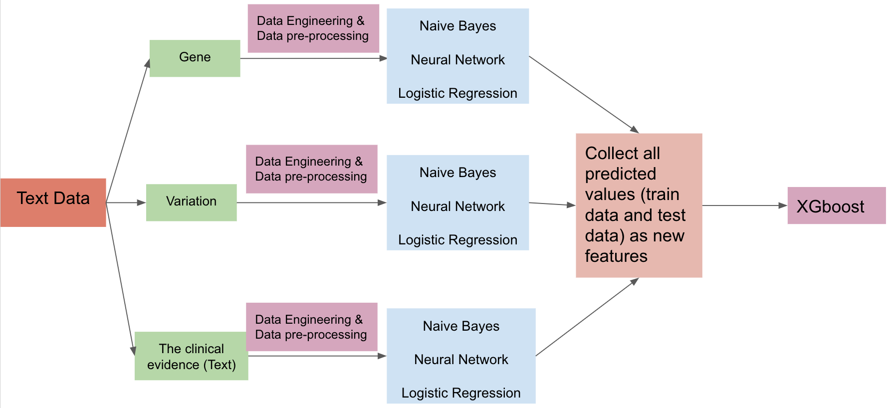
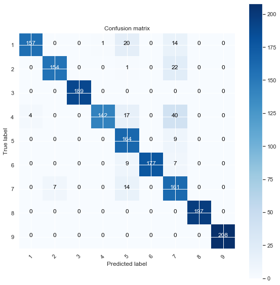

# Project Title
Personalized Medicine: Redefining Cancer Treatment

# Project Goal 
To predict the effect of Genetic Variants to enable Personalized Medicine
# Overview
Every year, there are 7 million patients who suffer from cancer worldwide, and 5 million people die of cancer. 60% of patients can only survive for around 5 years after diagnosis. However, no matter what kind of cancer, there are specific changes in the genome in terms of the specific type of tumor (typing) or the different stages of development.

 The genome changes (causes) cell differentiation, Abnormal development, and growth transmission which may be caused by gene mutation or genetic inheritance. In order to avoid a huge amount of manual work for the researchers, machine learning & deep learning plays a very important role in this territory. For example, a cancer tumor may have thousands of genetic mutations in a DNA sequence and the challenge is to distinguish the mutations that contribute to tumor growth from the neutral mutations. Nowadays, a lot of researchers still study how genetic testing can help us to find a way to treat these cancers.

This project is based on text-based clinical literature, annotated mutations, and Genes Where Mutation is Located, I developed some Machine Learning algorithms using the genomics knowledge to automatically classify genetic variations. The data is from Kaggle, and the attribute information includes ID and the Gene where this genetic mutation is located; Variation — The amino acid change for mutations; Text — The clinical evidence used to classify the genetic mutation; The Class column contains the genetic mutation that has been classified on. 
#### Attribute Information
- Gene: The gene where this genetic mutation is located)
- Variation: The aminoacid change for this mutations)
- Text: The clinical evidence used to classify the genetic mutation
- Class: 1-9 the class this genetic mutation has been classified on

# EDA
## Target Distribution

## Genes Distribution
The bar chart shows the top 30 genes where mutations are located. The first place is BRCA1 and you can see there is a gene named BRCA2 in fifth place. What are they? The name “BRCA” is an abbreviation for the “Breast Cancer Gene.” BRCA1 and BRCA2 are two different genes that have been found to impact a person’s chances of developing breast cancer. Additionally, the changes in the TP53 gene greatly increases the risk of developing breast cancer, bladder cancer, and lung cancer, etc. Besides, there are around eight mutations in the EGFR gene have been associated with lung cancer.

## Genes & Classes
After knowing those genes and the potential risks of their mutations, Let us take look at bar charts for each class. Obviously, one gene could be classified in different classes. For example, the gene BRCA1 is almost in all classes, which means one type of gene could have more than one mutation. The gene like “PTEN” predominantly presents in a single Class. On the other hand, there are a few genes in Class 8 and Class 9.

## Variations Distribution
In our dataset, there are a total of 2993 different variations and each variation matches one or more genes. Not all variations can cause cancers but they may influence cancer risk.

## Variations & Classes
In Class 1, the one has most frequency is Truncating Mutations which is in second place in Class 6. Fusions, Deletion, Amplification have high frequencies in Class 2,4, and 6&7 respectively. On the other hand, the number of each variation’s frequency is one (1) in Class 3,5,8 and 9.

## Text Data - Bigrams 

# Model Stacking

# Summary

## Results Before Model Stacking

### Naive Bayes

#### $Gene$
 - Train data f1 score:0.6157672054520656
 - Test data f1 score:0.5930716695679839
 
#### $Variation$
 - Train data f1 score:0.9774319139048305
 - Test data f1 score:0.8126132108732343
 
#### $Cleaned_text$
 - Train data f1 score:0.798351080032705
 - Test data f1 score:0.7846091468870092
 
### Neural Network

#### $Gene$
 - Train data f1 score:0.6157205891605201
 - Test data f1 score:0.5939324450221499
 
#### $Variation$
 - Train data f1 score:0.9780175131194836
 - Test data f1 score:0.9038712574030837
 
#### $Cleaned_text$
 - Train data f1 score:0.9014796254055549
 - Test data f1 score:0.8585273978514553

### Logistic Regression

#### $Gene$
 - Train data f1 score:0.615936855192663
 - Test data f1 score:0.5957018668273237
 
#### $Variation$
 - Train data f1 score:0.9769987251836152
 - Test data f1 score:0.9029228363338574
 
#### $Cleaned_text$
 - Train data f1 score:0.9039234128069726
 - Test data f1 score:0.8628257154404384
 
## Results After Model Stacking

### XGboost
- F1 Score of train data : 0.99
- F1 Score of test data : 0.92

-Before model stacking, the highest F1 score from neural network is 0.90.
After model stacking, the F1 score is 0.92. 
The final F1 score increased 2% Based on the confusion matrix below, we can see that the model stacking method worked very well.

