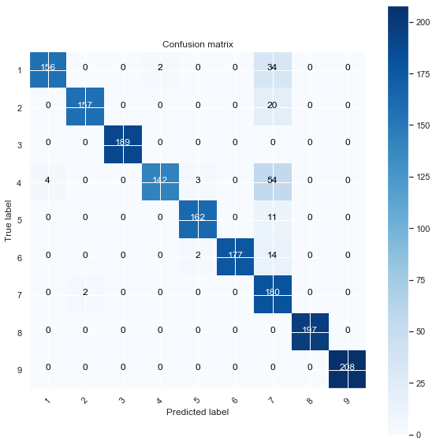

# Project Title
Personalized Medicine: Redefining Cancer Treatment
# Project Goal 
To predict the effect of Genetic Variants to enable Personalized Medicine
# Overview
Every year, there are 7 million patients who suffer from cancer worldwide, and 5 million people die of cancer. 60% of patients can only survive for around 5 years after diagnosis. However, no matter what kind of cancer, there are specific changes in the genome in terms of the specific type of tumor (typing) or the different stages of development. The genome changes (causes) cell differentiation, Abnormal development, and growth transmission which may be caused by gene mutation or genetic inheritance. Once a DNS sequence obtained, a cancer tumor may have thousands of genetic mutations and the challenge is to distinguish the mutations that contribute to tumor growth from the neutral mutations. 
This project is based on text-based clinical literature, annotated mutations, and Genes Where Mutation is Located, I developed some Machine Learning algorithms that, using this knowledge base to automatically classify genetic variations.

# Attribute Information
- Gene: The gene where this genetic mutation is located)
- Variation: The aminoacid change for this mutations)
- Text: The clinical evidence used to classify the genetic mutation
- Class: 1-9 the class this genetic mutation has been classified on

# EDA
## Target Distribution

## Genes Distribution

## Genes & Classes

## Variations Distribution

## Variations & Classes

## Text Data - Bigrams 

# Model Stacking

# Summary

## Results Before Model Stacking

### Naive Bayes

#### $Gene$
 - Train data f1 score:0.6157672054520656
 - Test data f1 score:0.5930716695679839
 
#### $Variation$
 - Train data f1 score:0.9774319139048305
 - Test data f1 score:0.8126132108732343
 
#### $Cleaned_text$
 - Train data f1 score:0.798351080032705
 - Test data f1 score:0.7846091468870092
 
### Neural Network

#### $Gene$
 - Train data f1 score:0.6157205891605201
 - Test data f1 score:0.5939324450221499
 
#### $Variation$
 - Train data f1 score:0.9780175131194836
 - Test data f1 score:0.9038712574030837
 
#### $Cleaned_text$
 - Train data f1 score:0.9014796254055549
 - Test data f1 score:0.8585273978514553

### Logistic Regression

#### $Gene$
 - Train data f1 score:0.615936855192663
 - Test data f1 score:0.5957018668273237
 
#### $Variation$
 - Train data f1 score:0.9769987251836152
 - Test data f1 score:0.9029228363338574
 
#### $Cleaned_text$
 - Train data f1 score:0.9039234128069726
 - Test data f1 score:0.8628257154404384
 
## Results After Model Stacking

### XGboost
- F1 Score of train data : 0.995473205118092
- F1 Score of test data : 0.9070306366113982

-Before model stacking, the highest F1 score from neural network is 0.9029.
After model stacking, the F1 score is 0.9070. 
The final F1 score increased 0.004. Based on the confusion matrix below, we can see that the model stacking method worked very well.

